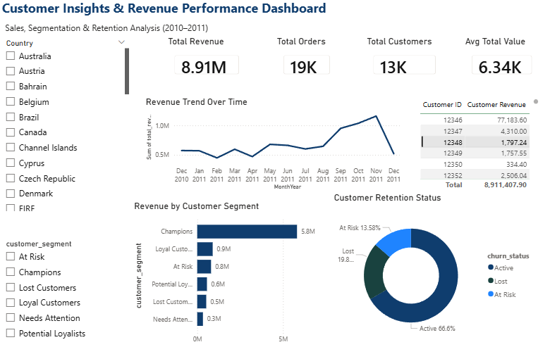

# 🧠 Customer Insights & Revenue Performance Dashboard

An end-to-end analytics project that transforms transactional retail data into actionable customer insights using data modelling, segmentation, and visualisation.

---

## 📸 Dashboard Preview



---

## 🎯 Objective

To build a customer insights dashboard that:

* Tracks revenue performance over time
* Identifies high-value customer segments
* Analyses customer retention and churn risk
* Supports data-driven business decisions

---

## 📊 Dataset

* **Source:** UCI Online Retail Dataset (UK-based e-commerce transactions)
* **Period:** 2010–2011
* **Data Includes:**

  * Customer transactions
  * Order-level data
  * Revenue metrics

---

## 🛠️ Tools & Technologies

* **Python (Pandas):** Data cleaning and transformation
* **Power BI:** Data modelling and dashboard development
* **SQL:** Reference queries for transformation logic

---

## 📊 Dashboard Overview

### 🔹 KPI Cards

* Total Revenue
* Total Orders
* Total Customers
* Average Order Value

👉 Provides a high-level snapshot of business performance

---

### 📈 Revenue Trend

* Monthly revenue analysis

👉 Identifies patterns, trends, and potential seasonality

---

### 📊 Customer Segmentation

* Revenue contribution by segment

👉 Highlights which customer groups drive the most revenue

---

### 🍩 Customer Retention (Churn Analysis)

* Active vs At Risk vs Lost customers

👉 Helps prioritise retention strategies

---

### 📋 Top Customers

* High-value customers based on revenue

👉 Supports targeted engagement and marketing

---

### 🎛️ Filters

* Country
* Customer Segment

👉 Enables dynamic exploration of the data

---

## 🧠 Key Insights

* A small group of high-value customer segments contributes a significant share of total revenue
* A notable portion of customers fall into “At Risk” and “Lost” categories
* Revenue trends show variability across months, suggesting changes in customer behaviour

---

## 💡 Business Impact

* Focus retention efforts on high-value customers to protect revenue
* Target “At Risk” customers with timely engagement strategies
* Use segmentation to personalise marketing and improve conversion
* Monitor trends to support planning and forecasting

---
## ⚙️ Data Model


* Multiple structured datasets used for performance optimisation
* Pre-aggregated tables used for trend and segmentation analysis
* Separate churn summary table created to ensure accurate aggregation

---

## 🧾 Power BI Logic

See:

```text
powerbi/powerbi_measures.md
```

---

## 🚀 Conclusion

This project showcases a practical approach to customer analytics by combining data preparation, segmentation, and visualisation to support business decision-making.
